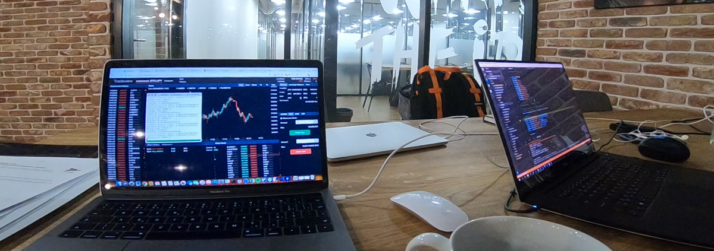


# Cryptocurrency websocket extensions [](https://travis-ci.org/Marfusios/crypto-websocket-extensions) [](https://badge.fury.io/nu/Crypto.Websocket.Extensions)

This is a library that provides extensions to cryptocurrency websocket exchange clients. 

It helps to unify data models and usage of more clients together. 

[Releases and breaking changes](https://github.com/Marfusios/crypto-websocket-extensions/releases)

### License: 
    Apache License 2.0

### Features

* installation via NuGet ([Crypto.Websocket.Extensions](https://www.nuget.org/packages/Crypto.Websocket.Extensions))
* targeting .NET Standard 2.0 (.NET Core, Linux/MacOS compatible)
* reactive extensions ([Rx.NET](https://github.com/Reactive-Extensions/Rx.NET))
* integrated logging abstraction ([LibLog](https://github.com/damianh/LibLog))

### Supported exchanges

| Logo | Name | Websocket client |
| ------------- | ------------- |:------:|
| [](https://www.bitfinex.com)  | [Bitfinex](https://www.bitfinex.com)  | [bitfinex-client-websocket](https://github.com/Marfusios/bitfinex-client-websocket) |
| [](https://www.bitmex.com/register/qGWwBG)  | [BitMEX](https://www.bitmex.com/register/qGWwBG)  | [bitmex-client-websocket](https://github.com/Marfusios/bitmex-client-websocket) |
| [](https://www.binance.com/?ref=21773680)  | [Binance](https://www.binance.com/?ref=21773680)  | [binance-client-websocket](https://github.com/Marfusios/binance-client-websocket) |

### Extensions

#### Order book

* `CryptoOrderBook` class - unified order book across all exchanges
* support for level2 market data (only differences in order book)
* provides streams:
    * `OrderBookUpdatedStream` - streams on an every order book update
    * `BidAskUpdatedStream` - streams when bid or ask price changed (top level of the order book)
* provides properties and methods:
    * `BidLevels` and `AskLevels` - ordered array of current state of the order book
    * `FindLevelByPrice` and `FindLevelById` - returns specific order book level

Usage:

```csharp
var url = BitmexValues.ApiWebsocketUrl;
var communicator = new BitmexWebsocketCommunicator(url);
var client = new BitmexWebsocketClient(communicator);

var pair = "XBTUSD";

var source = new BitmexOrderBookSource(client);
var orderBook = new CryptoOrderBook(pair, source);

// orderBook.BidAskUpdatedStream.Subscribe(xxx)
orderBook.OrderBookUpdatedStream.Subscribe(quotes =>
{
    var currentBid = orderBook.BidPrice;
    var currentAsk = orderBook.AskPrice;

    var bids = orderBook.BidLevels;
    // xxx
});
        
await communicator.Start();
```

More usage examples:
* integration tests ([link](test_integration/Crypto.Websocket.Extensions.Tests.Integration))
* console sample ([link](test_integration/Crypto.Websocket.Extensions.Sample/Program.cs))

**Pull Requests are welcome!**

### Powerfull Rx.NET

Don't forget that you can do pretty nice things with reactive extensions and observables. 
For example, if you want to check latest bid/ask prices from all exchanges all together, 
you can do something like this: 

```csharp
Observable.CombineLatest(new[]
            {
                bitmexOrderBook.BidAskUpdatedStream,
                bitfinexOrderBook.BidAskUpdatedStream,
                binanceOrderBook.BidAskUpdatedStream,
            })
            .Subscribe(HandleQuoteChanged);

// Method HandleQuoteChanged(IList<CryptoQuotes> quotes)
// will be called on every exchange's price change
```


### Multi-threading

Observables from Reactive Extensions are single threaded by default. It means that your code inside subscriptions is called synchronously and as soon as the message comes from websocket API. It brings a great advantage of not to worry about synchronization, but if your code takes a longer time to execute it will block the receiving method, buffer the messages and may end up losing messages. For that reason consider to handle messages on the other thread and unblock receiving thread as soon as possible. I've prepared a few examples for you: 

#### Default behavior

Every subscription code is called on a main websocket thread. Every subscription is synchronized together. No parallel execution. It will block the receiving thread. 

```csharp
client
    .Streams
    .TradesStream
    .Subscribe(trade => { code1 });

client
    .Streams
    .BookStream
    .Subscribe(book => { code2 });

// 'code1' and 'code2' are called in a correct order, according to websocket flow
// ----- code1 ----- code1 ----- ----- code1
// ----- ----- code2 ----- code2 code2 -----
```

#### Parallel subscriptions 

Every single subscription code is called on a separate thread. Every single subscription is synchronized, but different subscriptions are called in parallel. 

```csharp
client
    .Streams
    .TradesStream
    .ObserveOn(TaskPoolScheduler.Default)
    .Subscribe(trade => { code1 });

client
    .Streams
    .BookStream
    .ObserveOn(TaskPoolScheduler.Default)
    .Subscribe(book => { code2 });

// 'code1' and 'code2' are called in parallel, do not follow websocket flow
// ----- code1 ----- code1 ----- code1 -----
// ----- code2 code2 ----- code2 code2 code2
```

 #### Parallel subscriptions with synchronization

In case you want to run your subscription code on the separate thread but still want to follow websocket flow through every subscription, use synchronization with gates: 

```csharp
private static readonly object GATE1 = new object();
client
    .Streams
    .TradesStream
    .ObserveOn(TaskPoolScheduler.Default)
    .Synchronize(GATE1)
    .Subscribe(trade => { code1 });

client
    .Streams
    .BookStream
    .ObserveOn(TaskPoolScheduler.Default)
    .Synchronize(GATE1)
    .Subscribe(book => { code2 });

// 'code1' and 'code2' are called concurrently and follow websocket flow
// ----- code1 ----- code1 ----- ----- code1
// ----- ----- code2 ----- code2 code2 ----
```

### Available for help
I do consulting, please don't hesitate to contact me if you have a custom solution you would like me to implement ([web](http://mkotas.cz/), 
<m@mkotas.cz>)

Donations gratefully accepted.
* [](https://en.cryptobadges.io/donate/1HfxKZhvm68qK3gE8bJAdDBWkcZ2AFs9pw)
* [](https://en.cryptobadges.io/donate/LftdENE8DTbLpV6RZLKLdzYzVU82E6dz4W)
* [](https://en.cryptobadges.io/donate/0xb9637c56b307f24372cdcebd208c0679d4e48a47)
